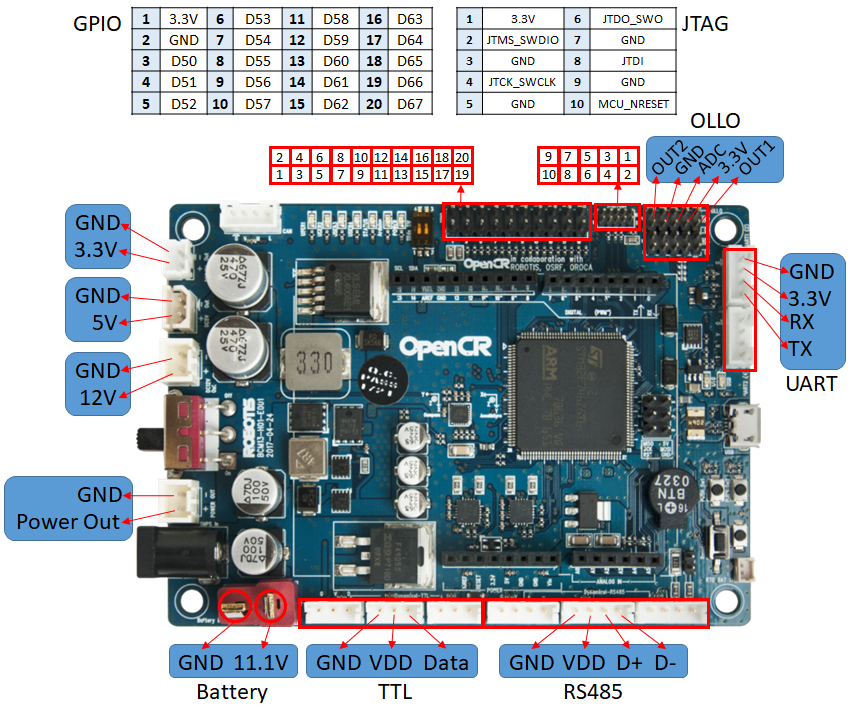
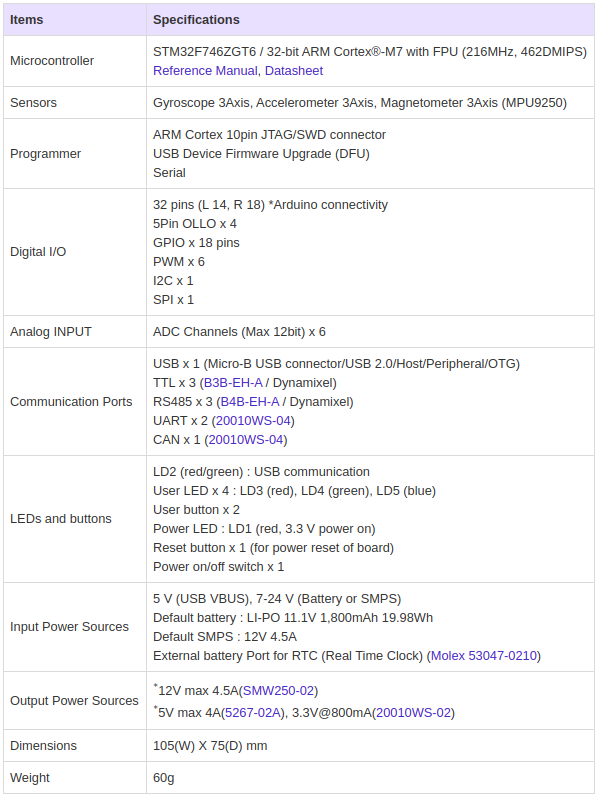
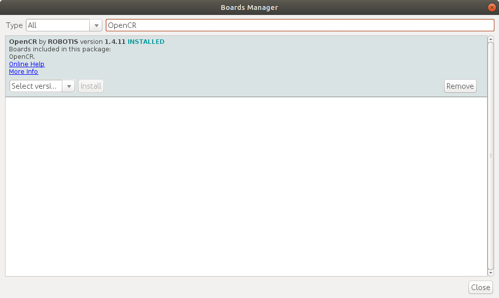

## ROS2 OPENCR EXPLORE

<!--
http://emanual.robotis.com/docs/en/parts/controller/opencr10/

https://github.com/ROBOTIS-GIT/OpenCR
https://github.com/ROBOTIS-GIT/OpenCR-Hardware

https://community.robotsource.org/t/howto-adding-multiple-opencr-boards-to-the-arduino-ide/1497

https://www.youtube.com/watch?v=1tqYrWqrbC8&list=PLRG6WP3c31_U7TFGduEIJWVtkOw6AJjFf

https://github.com/ROBOTIS-GIT/OpenCR-Binaries

https://www.youtube.com/watch?v=tdzMEzrN-PQ&list=PLRG6WP3c31_VTd-u90LVXaT1B8NMjCSoj&index=2
https://www.youtube.com/playlist?list=PLRG6WP3c31_VTd-u90LVXaT1B8NMjCSoj

https://github.com/ROBOTIS-GIT/OpenCR/tree/master/arduino/opencr_arduino/tools/opencr_tools_1.0.0

https://synthiam.com/GettingStarted/Build-Robots/Robotis-OpenCR-17531
-->

  

<!--  -->

### Linux Setup

#### Remove Modemmanager

$ sudo apt-get purge modemmanager  

#### USB Port Settings

$ wget https://raw.githubusercontent.com/ROBOTIS-GIT/OpenCR/master/99-opencr-cdc.rules  
$ sudo cp ./99-opencr-cdc.rules /etc/udev/rules.d/  
$ sudo udevadm control --reload-rules  
$ sudo udevadm trigger  

#### Compiler Settings

$ sudo apt-get install libncurses5-dev:i386  

#### Install Arduino IDE

$ ./install.sh  
$ gedit ~/.bashrc  
$ export PATH=$PATH:$HOME/arduino  
$ source ~/.bashrc  
$ arduino  

#### Porting to Arduino IDE

File -> Preferences -> Additional Boards Manager URLs  

https://raw.githubusercontent.com/ROBOTIS-GIT/OpenCR/master/arduino/opencr_release/package_opencr_index.json  

#### Install the OpenCR package via Boards Manager

Click Tools -> Board -> Boards Manager  

#### Port Setting

Tools -> Port -> /dev/ttyACM0  

### Examples

#### LED

Blink_LED.ino

